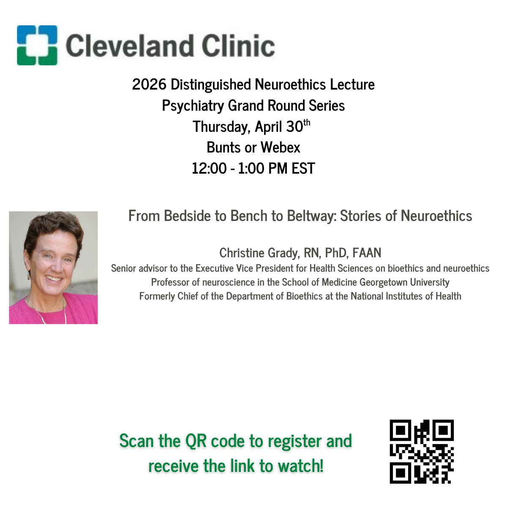
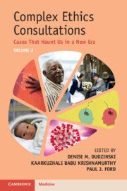

{.circle-photo width="200px"}

**Paul J. Ford, PhD** is Director of the [**Neuroethics Program** at Cleveland Clinic](https://my.clevelandclinic.org/departments/bioethics/neuroethics), where he leads interdisciplinary research and ethical practice in the diagnosis and treatment of neurological diseases.

Dr. Ford specializes in clinical and research neuroethics, working closely with teams in **deep brain stimulation**, **epilepsy surgery**, and related neurosurgical disciplines. His work combines **practical ethics consultation** with **qualitative research**, and he has authored more than 70 publications in journals such as *Neurology*, *The Hastings Center Report*, and *Science*.

He is an Associate Professor at Cleveland Clinic Lerner College of Medicine at Case Western Reserve University and he teaches medical students, residents, and fellows.

------------------------------------------------------------------------

## Connect

-   Email (work): [fordp\@ccf.org](mailto:fordp@ccf.org)
-   Email (personal): [neuroethics\@sbcglobal.net](mailto:neuroethics@sbcglobal.net)
-   [LinkedIn](https://www.linkedin.com/in/paul-ford-6972614/)
-   [ResearchGate](https://www.researchgate.net/profile/Paul-Ford-7)

------------------------------------------------------------------------

## Upcoming Neuroethics Sessions

:::{.callout-note title="Upcoming Neuroethics Session: Christine Grady, April 30, 2026. From Bedside to Bench to Beltway: Stories of Neuroethics."}

:::

## Recent Highlights

::: {.callout-note title="*Published Jan 2026* Complex Ethics Consultations, Volume 2, Co-edited by Dr. Paul J. Ford"}
{width="100px" style="float: right; margin-left: 20px;"}

***Complex Ethics Consultations: Cases That Haunt Us in a New Era***\
**Cambridge University Press, Volume 2 (2026)**\
*Book Description*: Clinical ethics consultants navigate some of the most challenging cases in patient care, public health, and healthcare policy. The second volume richly details haunting cases pertaining to perinatal, paediatric, and end-of life issues; neurodiversity; disability; and employment of high-tech devices. Authors explain distinctive features of consultations in rural and pandemic contexts and complicated transitions into and out of inpatient care. Cases are grouped together by theme and organized uniformly. Each chapter includes a case presentation, the authors' professional reflections, description of haunting aspects, case outcome, and questions for discussion. Organizational ethics factors into many of the cases. The authors honestly describe the affective aspects of their work, including lingering regrets, doubts, and moral distress. They pay special attention to justice, equity and inclusivity. It is a fascinating and important read for clinicians and bioethicists engaged in clinical ethics consultations as well as ethics committee members and students.\

📘 [Buy **Complex Ethics Consultations** Volume 2](https://www.cambridge.org/9781009400909)\
📘 [Buy **Complex Ethics Consultations** Volume 1, 2nd Edition Print](https://www.cambridge.org/9781009400954)\

Get 20% off these titles using code **CEC20** at checkout from Cambridge University Press. Offer valid through December 1, 2026. [Download Flyer (PDF)](/files/CEC_US%20Letter_Pre-order%20flyer.pdf)

If your institution subscribes to *Cambridge Core* then you should be able to access individual chapters electronically:

[Read **Complex Ethics Consultations** Volume 2](https://www.cambridge.org/core/books/complex-ethics-consultations/D09B15E9E2B502253E4A1BFCAA7A9D1C)

[Read **Complex Ethics Consultations** Volume 1, 2nd Edition](https://www.cambridge.org/core/books/complex-ethics-consultations/CEC63BD47F3853754F6C24AC475A2151)

For suggested uses in teaching, see LinkedIn posts:

-   [C-Section Ethics](https://www.linkedin.com/posts/paul-ford-phd-6972614_complex-ethics-consultations-activity-7426621641503416320-475N?utm_source=share&utm_medium=member_desktop&rcm=ACoAAAC_yJMBvn1lHt_Wuos6GimpcDZv1Gzfihc)

-   [Chronic Pain (Outpatient)](https://www.linkedin.com/posts/paul-ford-phd-6972614_complex-ethics-consultations-activity-7430235139361816576-Micz?utm_source=share&utm_medium=member_desktop&rcm=ACoAAAC_yJMBvn1lHt_Wuos6GimpcDZv1Gzfihc)

-   [Chronic Pain (Inpatient)](https://www.linkedin.com/posts/paul-ford-phd-6972614_suffering-as-gods-will-chapter-20-complex-activity-7434222185956720640-rp0N?utm_source=share&utm_medium=member_desktop&rcm=ACoAAAC_yJMBvn1lHt_Wuos6GimpcDZv1Gzfihc)

-   [Judicial/Legal](https://www.linkedin.com/posts/paul-ford-phd-6972614_when-we-commit-harm-by-omission-chapter-activity-7437123629726863360-WDAb?utm_source=share&utm_medium=member_desktop&rcm=ACoAAAC_yJMBvn1lHt_Wuos6GimpcDZv1Gzfihc)
:::

-   📺 [Media Engagement](media.qmd)
-   📄 [Recent Publications](publications.qmd)

------------------------------------------------------------------------

## Learn More

-   [About Dr. Ford](about.qmd)
-   [Research Interests](research.qmd)
-   [Curriculum Vitae](cv.qmd)
-   [Cleveland Clinic Neuroethics](https://my.clevelandclinic.org/departments/bioethics/neuroethics)
